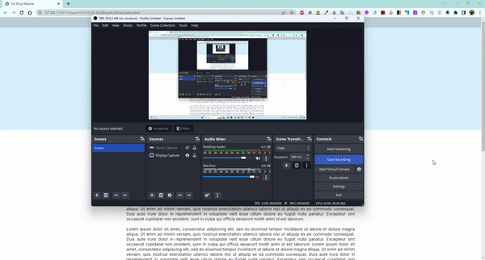

# Blog Site

A blog is built using html and css layouts without using flexbox or grid.  

The blog is responsive and works on Pc and mobile phones.

# Figma Design to make

<a href="https://www.figma.com/file/GH5SiOF5ZcP3I3HzF0vH6D/WSC-Blog-Post?node-id=1-2&t=uOAGjBeOTEDiprOT-0"> Figma Design </a>

# Screenshots

### Desktop

### Mobile

# Live Demo

<a href="https://blog-site-abdelrahman.netlify.app/"> Live Demo </a>
